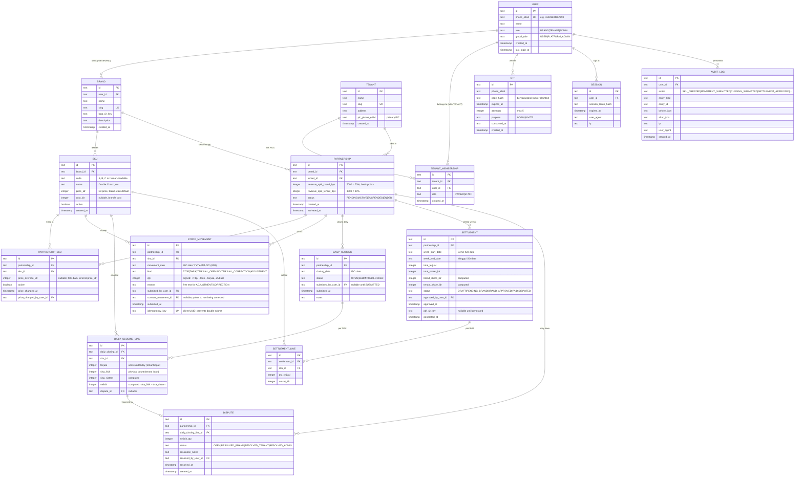

# Kongsian — Data Model

## 1. ER diagram (mermaid)



---

## 2. Drizzle schema (TypeScript)

The schema lives at `apps/web/src/server/db/schema.ts`. Field types map to D1's SQLite. Money is `integer` IDR (no decimals). Dates are stored as `text` in ISO `YYYY-MM-DD` format. Timestamps are Unix seconds (integer) for easy comparison.

```ts
// apps/web/src/server/db/schema.ts
import { sqliteTable, text, integer, index, uniqueIndex } from 'drizzle-orm/sqlite-core';
import { sql } from 'drizzle-orm';

export const users = sqliteTable('users', {
  id: text('id').primaryKey(),
  phoneE164: text('phone_e164').notNull().unique(),
  name: text('name').notNull(),
  globalRole: text('global_role', { enum: ['USER', 'PLATFORM_ADMIN'] }).notNull().default('USER'),
  createdAt: integer('created_at').notNull().default(sql`(unixepoch())`),
  lastLoginAt: integer('last_login_at'),
});

export const brands = sqliteTable('brands', {
  id: text('id').primaryKey(),
  userId: text('user_id').notNull().references(() => users.id),
  name: text('name').notNull(),
  slug: text('slug').notNull().unique(),
  logoR2Key: text('logo_r2_key'),
  description: text('description'),
  createdAt: integer('created_at').notNull().default(sql`(unixepoch())`),
});

export const tenants = sqliteTable('tenants', {
  id: text('id').primaryKey(),
  name: text('name').notNull(),
  slug: text('slug').notNull().unique(),
  address: text('address'),
  picPhoneE164: text('pic_phone_e164').notNull(),
  createdAt: integer('created_at').notNull().default(sql`(unixepoch())`),
});

export const tenantMemberships = sqliteTable('tenant_memberships', {
  id: text('id').primaryKey(),
  tenantId: text('tenant_id').notNull().references(() => tenants.id, { onDelete: 'cascade' }),
  userId: text('user_id').notNull().references(() => users.id, { onDelete: 'cascade' }),
  role: text('role', { enum: ['OWNER', 'STAFF'] }).notNull().default('OWNER'),
  createdAt: integer('created_at').notNull().default(sql`(unixepoch())`),
}, (t) => ({
  uniqUserTenant: uniqueIndex('uniq_user_tenant').on(t.userId, t.tenantId),
}));

export const skus = sqliteTable('skus', {
  id: text('id').primaryKey(),
  brandId: text('brand_id').notNull().references(() => brands.id, { onDelete: 'cascade' }),
  code: text('code').notNull(),       // "A", "B", "C" or "DC", "STR", "TI"
  name: text('name').notNull(),
  priceIdr: integer('price_idr').notNull(),
  costIdr: integer('cost_idr'),
  active: integer('active', { mode: 'boolean' }).notNull().default(true),
  createdAt: integer('created_at').notNull().default(sql`(unixepoch())`),
}, (t) => ({
  uniqBrandCode: uniqueIndex('uniq_brand_code').on(t.brandId, t.code),
}));

export const partnerships = sqliteTable('partnerships', {
  id: text('id').primaryKey(),
  brandId: text('brand_id').notNull().references(() => brands.id, { onDelete: 'cascade' }),
  tenantId: text('tenant_id').notNull().references(() => tenants.id, { onDelete: 'cascade' }),
  // basis points: 7000 = 70%
  revenueSplitBrandBps: integer('revenue_split_brand_bps').notNull().default(7000),
  revenueSplitTenantBps: integer('revenue_split_tenant_bps').notNull().default(3000),
  status: text('status', { enum: ['PENDING', 'ACTIVE', 'SUSPENDED', 'ENDED'] })
    .notNull().default('PENDING'),
  createdAt: integer('created_at').notNull().default(sql`(unixepoch())`),
  activatedAt: integer('activated_at'),
}, (t) => ({
  uniqBrandTenant: uniqueIndex('uniq_brand_tenant').on(t.brandId, t.tenantId),
  idxStatus: index('idx_partnership_status').on(t.status),
}));

export const partnershipSkus = sqliteTable('partnership_skus', {
  id: text('id').primaryKey(),
  partnershipId: text('partnership_id').notNull().references(() => partnerships.id, { onDelete: 'cascade' }),
  skuId: text('sku_id').notNull().references(() => skus.id, { onDelete: 'cascade' }),
  priceOverrideIdr: integer('price_override_idr'),
  active: integer('active', { mode: 'boolean' }).notNull().default(true),
  priceChangedAt: integer('price_changed_at'),
  priceChangedByUserId: text('price_changed_by_user_id').references(() => users.id),
}, (t) => ({
  uniqPartnershipSku: uniqueIndex('uniq_partnership_sku').on(t.partnershipId, t.skuId),
}));

export const stockMovements = sqliteTable('stock_movements', {
  id: text('id').primaryKey(),
  partnershipId: text('partnership_id').notNull().references(() => partnerships.id),
  skuId: text('sku_id').notNull().references(() => skus.id),
  movementDate: text('movement_date').notNull(),  // 'YYYY-MM-DD' WIB
  kind: text('kind', {
    enum: ['TITIP', 'TARIK', 'TERJUAL_OPENING', 'TERJUAL_CORRECTION', 'ADJUSTMENT'],
  }).notNull(),
  qty: integer('qty').notNull(),  // signed
  reason: text('reason'),
  submittedByUserId: text('submitted_by_user_id').notNull().references(() => users.id),
  correctsMovementId: text('corrects_movement_id'),
  submittedAt: integer('submitted_at').notNull().default(sql`(unixepoch())`),
  idempotencyKey: text('idempotency_key').notNull().unique(),
}, (t) => ({
  idxPartnershipSkuDate: index('idx_mov_psd').on(t.partnershipId, t.skuId, t.movementDate),
}));

export const dailyClosings = sqliteTable('daily_closings', {
  id: text('id').primaryKey(),
  partnershipId: text('partnership_id').notNull().references(() => partnerships.id),
  closingDate: text('closing_date').notNull(),
  status: text('status', { enum: ['OPEN', 'SUBMITTED', 'LOCKED'] }).notNull().default('OPEN'),
  submittedByUserId: text('submitted_by_user_id').references(() => users.id),
  submittedAt: integer('submitted_at'),
  notes: text('notes'),
}, (t) => ({
  uniqPartnershipDate: uniqueIndex('uniq_closing_pd').on(t.partnershipId, t.closingDate),
}));

export const dailyClosingLines = sqliteTable('daily_closing_lines', {
  id: text('id').primaryKey(),
  dailyClosingId: text('daily_closing_id').notNull().references(() => dailyClosings.id, { onDelete: 'cascade' }),
  skuId: text('sku_id').notNull().references(() => skus.id),
  terjual: integer('terjual').notNull(),
  sisaFisik: integer('sisa_fisik').notNull(),
  sisaSistem: integer('sisa_sistem').notNull(),
  selisih: integer('selisih').notNull(),
  disputeId: text('dispute_id'),
}, (t) => ({
  uniqClosingSku: uniqueIndex('uniq_closing_sku').on(t.dailyClosingId, t.skuId),
}));

export const settlements = sqliteTable('settlements', {
  id: text('id').primaryKey(),
  partnershipId: text('partnership_id').notNull().references(() => partnerships.id),
  weekStartDate: text('week_start_date').notNull(),
  weekEndDate: text('week_end_date').notNull(),
  totalTerjual: integer('total_terjual').notNull(),
  totalOmzetIdr: integer('total_omzet_idr').notNull(),
  brandShareIdr: integer('brand_share_idr').notNull(),
  tenantShareIdr: integer('tenant_share_idr').notNull(),
  status: text('status', {
    enum: ['DRAFT', 'PENDING_BRAND', 'BRAND_APPROVED', 'PAID', 'DISPUTED'],
  }).notNull().default('DRAFT'),
  approvedByUserId: text('approved_by_user_id').references(() => users.id),
  approvedAt: integer('approved_at'),
  pdfR2Key: text('pdf_r2_key'),
  generatedAt: integer('generated_at').notNull().default(sql`(unixepoch())`),
}, (t) => ({
  uniqPartnershipWeek: uniqueIndex('uniq_settlement_pw').on(t.partnershipId, t.weekStartDate),
}));

export const settlementLines = sqliteTable('settlement_lines', {
  id: text('id').primaryKey(),
  settlementId: text('settlement_id').notNull().references(() => settlements.id, { onDelete: 'cascade' }),
  skuId: text('sku_id').notNull().references(() => skus.id),
  qtyTerjual: integer('qty_terjual').notNull(),
  omzetIdr: integer('omzet_idr').notNull(),
});

export const otps = sqliteTable('otps', {
  id: text('id').primaryKey(),
  phoneE164: text('phone_e164').notNull(),
  codeHash: text('code_hash').notNull(),
  expiresAt: integer('expires_at').notNull(),
  attempts: integer('attempts').notNull().default(0),
  purpose: text('purpose', { enum: ['LOGIN', 'INVITE'] }).notNull(),
  consumedAt: integer('consumed_at'),
  createdAt: integer('created_at').notNull().default(sql`(unixepoch())`),
}, (t) => ({
  idxPhonePurpose: index('idx_otp_pp').on(t.phoneE164, t.purpose),
}));

export const sessions = sqliteTable('sessions', {
  id: text('id').primaryKey(),
  userId: text('user_id').notNull().references(() => users.id, { onDelete: 'cascade' }),
  sessionTokenHash: text('session_token_hash').notNull(),
  expiresAt: integer('expires_at').notNull(),
  userAgent: text('user_agent'),
  ip: text('ip'),
});

export const auditLog = sqliteTable('audit_log', {
  id: text('id').primaryKey(),
  userId: text('user_id').notNull().references(() => users.id),
  action: text('action').notNull(),
  entityType: text('entity_type').notNull(),
  entityId: text('entity_id').notNull(),
  beforeJson: text('before_json'),
  afterJson: text('after_json'),
  ip: text('ip'),
  userAgent: text('user_agent'),
  createdAt: integer('created_at').notNull().default(sql`(unixepoch())`),
}, (t) => ({
  idxEntity: index('idx_audit_entity').on(t.entityType, t.entityId),
  idxUser: index('idx_audit_user').on(t.userId),
}));

export const disputes = sqliteTable('disputes', {
  id: text('id').primaryKey(),
  partnershipId: text('partnership_id').notNull().references(() => partnerships.id),
  dailyClosingLineId: text('daily_closing_line_id').notNull().references(() => dailyClosingLines.id),
  selisihQty: integer('selisih_qty').notNull(),
  status: text('status', {
    enum: ['OPEN', 'RESOLVED_BRAND', 'RESOLVED_TENANT', 'RESOLVED_ADMIN'],
  }).notNull().default('OPEN'),
  resolutionNotes: text('resolution_notes'),
  resolvedByUserId: text('resolved_by_user_id').references(() => users.id),
  resolvedAt: integer('resolved_at'),
  createdAt: integer('created_at').notNull().default(sql`(unixepoch())`),
});
```

---

## 3. Critical invariants (asserted in domain code + DB constraints)

These are non-negotiable; the data model exists to enforce them.

| # | Invariant | Enforced by |
|---|-----------|-------------|
| I1 | `revenue_split_brand_bps + revenue_split_tenant_bps === 10000` | Zod + domain assertion at partnership create |
| I2 | `sisa_sistem = (movements up to date) computed; never written by user | Computed in transaction; only domain function writes it |
| I3 | `selisih = sisa_fisik − sisa_sistem` (signed) | Computed |
| I4 | `settlement.week_start_date === Monday` and `week_end_date === Sunday` (WIB) | Cron generator; never user-entered |
| I5 | `stock_movement.idempotency_key` is unique per request | DB unique index; client supplies UUID |
| I6 | `daily_closing_line.daily_closing_id + sku_id` is unique | DB unique index; one line per SKU per closing |
| I7 | A `Settlement` can only transition `DRAFT → PENDING_BRAND → BRAND_APPROVED/PAID/DISPUTED` | State machine in domain code |
| I8 | `partnership_skus.price_changed_at` is set when override changes; UI shows 7-day notice before applying | Domain rule + UI gating |
| I9 | Once `daily_closing.status === SUBMITTED`, no movement rows can be added for that `(partnership, date)` without an `ADJUSTMENT` kind and an audit row | Domain check + audit log |
| I10 | `user.role` is derived from which side of a partnership they act on, not stored per-user | Computed at request time from `brands` / `tenant_memberships` |

---

## 4. Money & date conventions

**Money:** All monetary values are `integer` IDR, no decimals. `Rp42.000` = `42000`. Always pair with a `priceIdr` (singular). Splits computed as:

```ts
const brandShare = Math.floor(omzetIdr * brandBps / 10000);
const tenantShare = omzetIdr - brandShare; // remainder to tenant (handles rounding)
```

**Date vs datetime:** Stock and closing are date-only (`YYYY-MM-DD` text). Movements and audit rows have Unix timestamp integers. We **never** mix the two in queries without explicit conversion.

**TZ:** MVP is single-TZ `Asia/Jakarta`. The app does not store offset; it assumes WIB. The cron schedules are written in WIB in comments and converted to UTC in wrangler config (e.g. "Monday 00:00 WIB" = Sunday 17:00 UTC = `17 0 * * 0`).

**Why this matters:** A cafe closing at 23:59 Monday WIB then settlement running at 00:00 Tuesday WIB is unambiguous in single-TZ. Multi-TZ support is a Phase 2 problem; the schema is already designed to add `timezone` later without data migration.

---

## 5. Migration strategy

- Drizzle migrations in `apps/web/drizzle/`, versioned, applied via `wrangler d1 migrations apply kongsian-db-prod`.
- Initial migration: full schema above, generated by `drizzle-kit generate`.
- Seed: 0. Production seeds nothing; staging seeds Hanniel's 3 SKUs as test data.
- **No destructive migrations in prod.** Add a column → migrate. Rename a column → migrate with `ALTER TABLE RENAME` + deploy code that uses new name; old name dropped in a follow-up migration once the new code is stable.
- All migrations go through GitHub Actions with a dry-run on PR and an apply on merge to `main` against prod.

---

## 6. Query patterns the data model optimizes for

The most common reads (verified from xlsx workflow):

1. **Today's stock for a tenant** (every page load):
   ```sql
   SELECT sku_id,
          COALESCE(SUM(CASE WHEN kind='TITIP' THEN qty ELSE 0 END), 0) titip,
          COALESCE(SUM(CASE WHEN kind='TARIK' THEN qty ELSE 0 END), 0) tarik,
          COALESCE(SUM(CASE WHEN kind LIKE 'TERJUAL%' THEN qty ELSE 0 END), 0) terjual
     FROM stock_movements
    WHERE partnership_id = ? AND movement_date = ?
    GROUP BY sku_id;
   ```
   Covered by `idx_mov_psd`.

2. **This week's omzet per partnership** (settlement cron):
   ```sql
   SELECT partnership_id, sku_id, SUM(qty) total_terjual
     FROM stock_movements
    WHERE kind IN ('TERJUAL_OPENING','TERJUAL_CORRECTION')
      AND movement_date BETWEEN ? AND ?
    GROUP BY partnership_id, sku_id;
   ```

3. **A single closing's lines** (selisih page): direct PK lookup on `daily_closings` + `daily_closing_lines`.

4. **Open disputes across all partnerships** (admin dashboard): scan `disputes WHERE status='OPEN'`, no index needed at MVP scale.

D1's read replica is in the same region as the writer (single region); no eventual consistency surprises for the brand↔tenant read flow.
