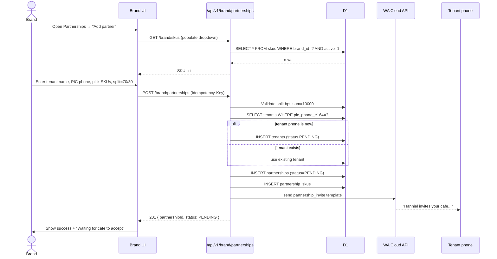
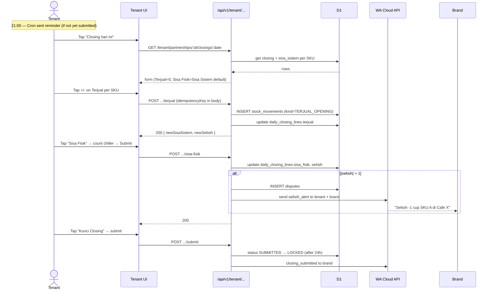
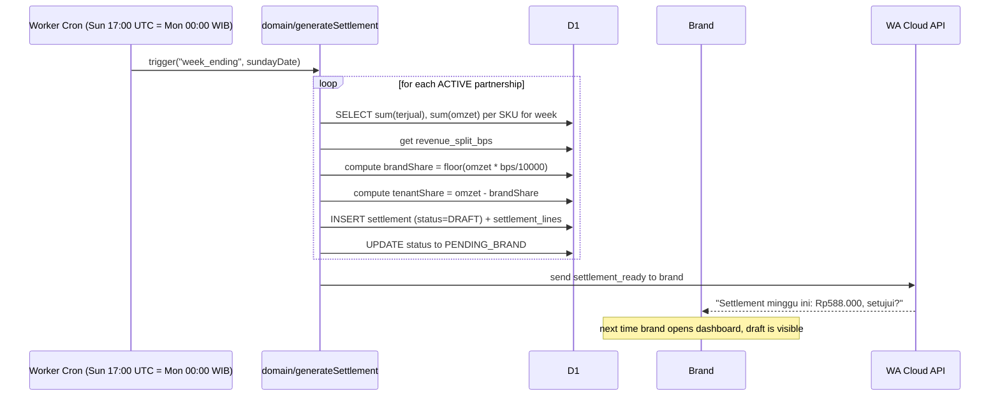
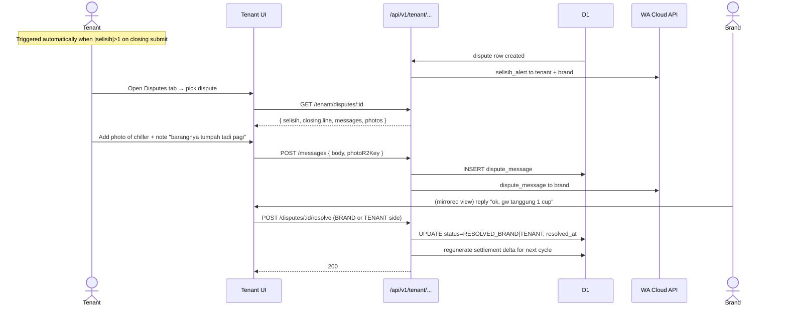

# Kongsian — User Flows

Each flow has (1) a Mermaid `sequenceDiagram` and (2) a one-paragraph happy-path description. Error branches are documented in [`edge-cases.md`](./edge-cases.md), not here.

**Actors:** `Brand` (Hanniel), `Tenant` (cafe PIC), `Admin` (Erwin), `WA` (Meta Cloud API), `Worker` (Astro/Cloudflare), `D1` (SQLite), `Cron` (scheduled Worker).

---

## (a) Brand creates partnership



**Happy path.** Brand goes to *Partnerships → Add partner*, picks SKUs from the dropdown (only her own active SKUs appear), enters the cafe's name, PIC phone number, and confirms the default 70/30 split. The system creates a `PENDING` partnership row, generates WA invite template to the PIC's phone, and shows the brand a "waiting for cafe to accept" state. The partnership flips to `ACTIVE` the first time that PIC verifies their OTP.

---

## (b) Brand records Titip

```mermaid
sequenceDiagram
    actor Brand
    participant UI as Brand UI
    participant API as /api/v1/brand/.../movements/titip
    participant DB as D1
    participant Tenant as Tenant dashboard

    Brand->>UI: Tap "Titip" → pick partner (cafe), date=today
    UI->>API: GET /brand/partnerships/:id/stock/today
    API->>DB: computeTitipFormSnapshot
    DB-->>API: per-SKU last stock + today's existing
    API-->>UI: form pre-filled with SKUs
    Brand->>UI: Fill qty for each SKU → Submit
    UI->>API: POST movements/titip (Idempotency-Key)
    API->>DB: BEGIN; INSERT stock_movements; COMMIT
    API-->>UI: 201 { movementId, newStockBySku }
    UI->>Brand: "Delivered 10 DC, 8 STR, 6 TIR to Cafe X"
    Note over Tenant: On next page load, dashboard shows new stock
```

**Happy path.** Brand opens *Movements → Titip*, picks the partner cafe, and the form auto-loads the cafe's active SKUs at the partnership's effective price. She taps +/- or types quantities, hits *Kirim* (Send). The system records an append-only `TITIP` movement row, returns the new per-SKU stock, and the tenant's dashboard reflects it on next page load (no realtime needed).

---

## (c) Tenant records Terjual + Sisa Fisik nightly



**Happy path.** At closing time (typically 21:00–22:00), the tenant opens the daily form. Each of the 3 Hanniel SKUs is a row with two big input cells: *Terjual* (sold) and *Sisa Fisik* (counted in the chiller). Tenant taps +/- or types; the system computes *Sisa Sistem* and *Selisih* live. On submit, the closing locks and—if |selisih| > 1—opens a dispute and alerts both sides via WhatsApp.

---

## (d) Sunday auto-settlement generation



**Happy path.** A Cloudflare Cron Trigger fires at Sunday 17:00 UTC (= Monday 00:00 WIB). For every `ACTIVE` partnership, the worker aggregates the week's `TERJUAL` movements by SKU, multiplies by the effective partnership-SKU price, applies the 70/30 split (rounding remainder to tenant), inserts a `SETTLEMENT` row with `PENDING_BRAND` status, and sends a WA template to the brand owner linking to the review page.

---

## (e) Brand approves settlement

```mermaid
sequenceDiagram
    actor Brand
    participant UI as Brand UI
    participant API as /api/v1/brand/settlements/:id/approve
    participant DB as D1
    participant WA as WA Cloud API
    participant Tenant

    Brand->>UI: Open Settlement review page
    UI->>API: GET /brand/settlements/:id
    API->>DB: SELECT settlement + lines + open disputes
    API-->>UI: { totals, per-SKU breakdown, disputes: [...] }
    Brand->>UI: Review; ack each open dispute (checkbox) or resolve inline
    UI->>API: POST /approve (acknowledgedDisputes:[...])
    API->>DB: validate state in PENDING_BRAND
    API->>DB: UPDATE status=BRAND_APPROVED, approved_at, approved_by
    API->>DB: INSERT audit_log
    API->>WA: send settlement_approved to tenant PIC
    WA-->>Tenant: "Settlement disetujui. Transfer Rp176.400 ke rekening X"
    API-->>UI: 200
    UI->>Brand: "Disetujui. Tenant sudah dapat notifikasi."
```

**Happy path.** Brand opens the settlement review page (linked from the WA). The page shows total omzet, the 70/30 split, per-SKU breakdown, and any open disputes inline. If there are open disputes, brand must either resolve them or explicitly acknowledge them before approval. On approve, the settlement locks, an audit row is written, and the tenant gets a WA with their share amount and the brand's payout instructions (recorded in the brand's profile, not enforced by Kongsian).

---

## (f) Tenant raises dispute



**Happy path.** Disputes are created automatically when a closing submits with |selisih| > 1 cup. Both parties get a WA alert. Tenant opens the dispute thread, attaches a photo of the chiller and a short note. Brand replies in the same thread. The first party to click *Resolve* closes the dispute (either side can, in MVP — admin override is the safety net). The settlement for the current week is locked from including this disputed amount; the next weekly cycle absorbs any written-off cups.

---

## (g) First-time OTP login

```mermaid
sequenceDiagram
    actor User
    participant UI as Login UI
    participant API as /api/v1/auth/otp/request
    participant DB as D1
    participant WA as WA Cloud API

    User->>UI: Open kongsian.com/login
    UI->>UI: Prefill phone from ?phone= query (if invite link)
    User->>UI: Enter phone → "Kirim Kode"
    UI->>API: POST /auth/otp/request
    API->>API: Validate E.164 format
    API->>DB: rate-limit check (5/hr phone, 20/hr ip)
    API->>DB: Generate 6-digit code; argon2id hash
    API->>DB: INSERT otps (expires_at = now+5min)
    API->>WA: send whatsapp_otp template
    WA-->>User: "Kode OTP Kongsian Anda: 482910. Berlaku 5 menit."
    API-->>UI: 200 { otpId, expiresAt }
    UI->>UI: Show "Masukkan 6 digit kode" + 4 input boxes
    User->>UI: Types 482910 → Submit
    UI->>API: POST /auth/otp/verify
    API->>DB: SELECT otp WHERE id=?
    API->>API: argon2.verify(codeHash, code)
    alt valid
        API->>DB: mark otp consumed
        API->>DB: SELECT user by phone (auto-create if dev)
        API->>DB: INSERT sessions, set __session cookie
        API-->>UI: 200 { user, memberships }
        UI->>UI: Redirect to /dashboard (role-based)
    else invalid
        API->>DB: increment attempts; if 5 → mark consumed, lock
        API-->>UI: 401 { error: OTP_INVALID }
    end
```

**Happy path.** First-time user (typically a cafe PIC who got an invite WA with a deep link) opens `kongsian.com/login?phone=628xxx`. Phone is pre-filled. They tap *Kirim Kode*; a 6-digit OTP is sent to their WhatsApp within seconds. They type the 4 boxes (or 6 — see wireframes), the system verifies the argon2 hash, creates a session cookie, and redirects to the dashboard. The user record is created on first successful verify (for tenant invites, the user is auto-linked to the tenant via `tenant_memberships`).
